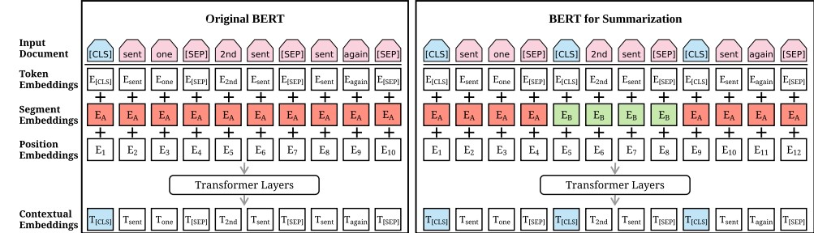
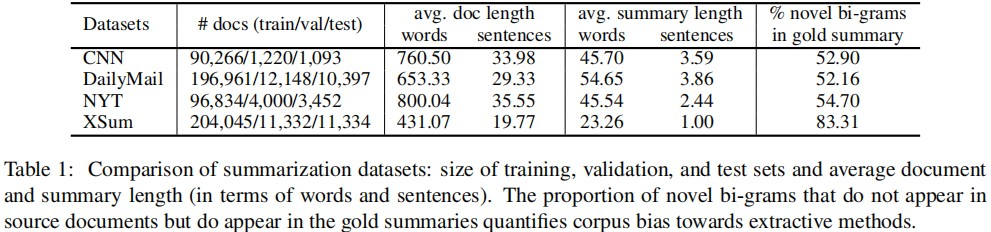
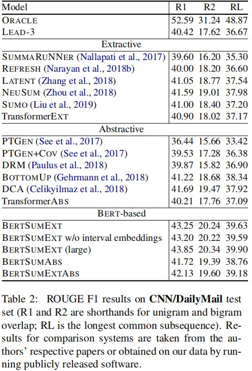
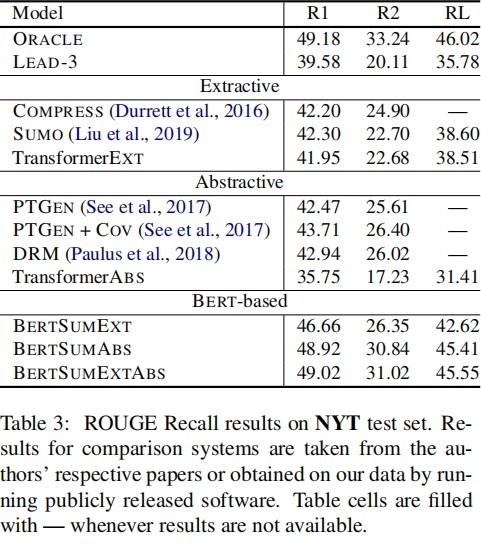
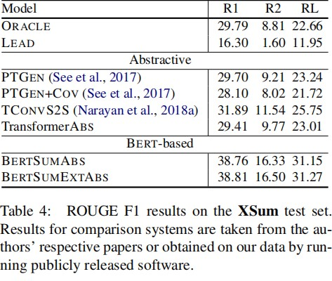
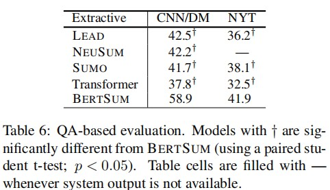
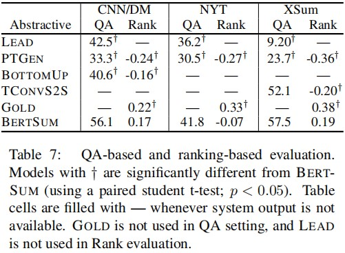
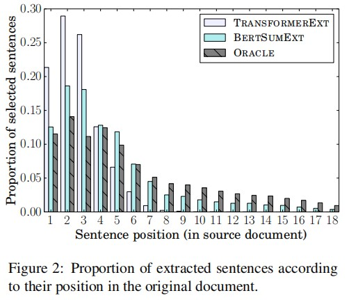
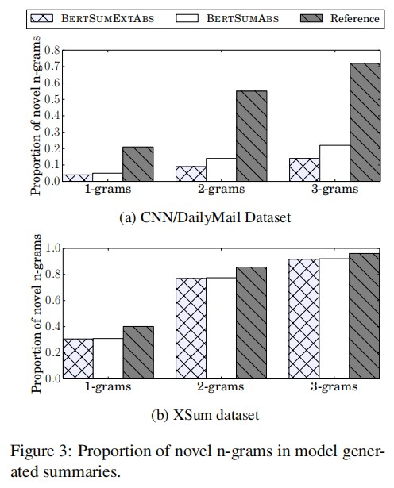

# 《使用预训练编码器的文本摘要》阅读报告
## 小组成员：孙璐阳，赵卓，何昕
### 背景介绍
- 近年来，预训练语言模型的出现大大提高了许多NLP任务的发展水平，包括情感分析、问题回答、自然语言推理、命名实体识别、文本相似性等等NLP任务。最先进的预训练模型包括ELMo、GPT以及来自Transformer的BERT。在大多数情况下，这些预训练模型可以被用作句子级和段落级的自然语言理解问题的编码器，相关的问题比如预测任意的两个句子是否具有蕴含关系，比如在四个可选择的句子中选择出正确的完整句子。
- 然而预训练模型在文本摘要中的应用还未开发完备。这是因为文本摘要和以前的NLP任务相比，实现难度更大。文本摘要的目标是将文本压缩成较短的版本，同时还要保留其大部分的含义。这需要预训练模型不仅仅有对单个单词或者句子的理解能力，还要有覆盖全篇，词句相连的理解能力。具体来说，文本摘要又可以分为抽取式文本摘要和生成式文本摘要：抽取式文本摘要需要模型对原文本中的每个句子是否应该保留做出判断，最终留下的句子作为摘要；生成式文本摘要则需要模型具有语言生成能力，能够通过对原文本的理解分析，尽量不使用原文本出现过的句子生成新的文本摘要。
- 在这种情况下，本文探索了预训练模型BERT在文本摘要的应用。本文提出了一种基于BERT的新型文档级编码器，并基于该编码器为抽取式文本摘要和生成式文本摘要提出了一个通用的框架，三个数据集的实验结果对比表明，该框架在抽取式文本摘要和生成式文本摘要中都取得了全面领先的结果。
 

### 现有方法
#### 抽取式摘要方法
- 现有抽取式摘要方法通过识别一个文档中最重要的句子然后连接生成摘要。神经模型是常用的模型之一，它将抽取式摘要看成是一个分类问题：由神经编码器为每个句子建立表示，然后由分类器决定哪个句子应该被选择留下作为摘要，SUMMARUNNER是最早采用基于递归神经网络编码器的神经模型之一。此外，REFRESH是一个基于强化学习的系统，通过全局优化ROUGE指标进行训练。近年来，越来越多的优秀工作通过更复杂的模型结构实现了更好的性能表现：LATENT将抽取式摘要定义为一个潜在的变量推理问题，该模型直接最大化选定句子作为人类摘要的可能性，而不是最大化“黄金”标准标签的可能性。SUMO利用结构化注意力的概念在预测输出摘要时引入文档的多根依赖书表示。NEUSUM同时选择句子并评分，代表了抽取式摘要的最新技术。
 

#### 生成式摘要方法
- 现有生成式摘要方法将摘要任务抽象为一个序列到序列的问题。编码器将源文档 $x=[x_1,\dots,x_n]$ 中的标记序列映射到连续表示序列 $x=[z_1,\dots,z_n]$ ，然后解码器以自回归的方式逐个生成摘要 $y=[y_1,\dots,y_n]$ ，从而对条件概率进行建模：$p(y_1,\dots,y_n|x_1,\dots,x_n)$。Rush和Nallapati等人是最早讲神经编码器-解码器模型用于生成式摘要的人之一。Abigail See等人使用指针生成器网络（PTGEN）增强此模型，该网络允许模型从源文本中复制单词，并使用覆盖机制（COV）跟踪已总结的单词。Celikyilmaz提出了一个抽象系统，其中多个代理（编码器）表示文档并且带有用于解码的分层注意机制（在代理之上），他们的深度通信代理 （DCA）模型通过强化学习进行端到端训练。Paulus等人还提出了一个用于抽象摘要的深度强化模型（DRM），它通过内部注意机制处理覆盖问题，在这种机制中，解码器会处理先前生成的单词。Gehrmann等人遵循自下而上的方法（BOTTOMUP），内容选择器首先确定源文档中的哪些短语应该是摘要的一部分，并且在解码期间复制机制仅应用于预选短语。Narayan等人提出了一种抽象模型，该模型特别适用于极端摘要（即单句摘要），该模型基于卷积神经网络并以主题分布（TCONVS2S）为条件。
 

### 本文方法及优势
#### BERT
- BERT是一种新的语言预训练模型，在3300M单词的语料库上使用掩码语言建模和“下一句预测”任务进行训练，并且可以根据不同的特定目标进行微调，在很多NLP任务的应用上都取得了比较好的结果。
- BERT的一般架构如图 1 的左侧部分所示。输入文本首先通过插入两个特殊标记进行预处理：$[CLS]$ 附加在正文的开头，该标记的输出表示用于聚合来自整个序列的信息；相应的，在每个句子之后插入标记 $[SEP]$ 作为句子边界的指示符。然后将修改后的文本表示为标记序列 $X = [w_1,\dots,w n ]$。每个标记 $w_i$ 被分配了三种嵌入：标记嵌入表示每个标记的含义，分段嵌入用于区分两个句子，位置嵌入表示文本序列中的每个标记。这三个嵌入被加到一个输入向量 $xi$ 中，并发送到具有多层的双向 Transformer：
$$ (1)$$
$$ (2)$$
其中 $h_0=x$ 是输入向量，$LN$ 是层归一化操作，$MHAtt$ 是多头注意力操作，上标 $l$ 表示堆叠层的深度。在顶层，BERT将为每个具有丰富上下文信息的标记生成一个输出向量$t_i$。

 

#### 微调BERT用于文本摘要
- 本文的工作基于BERT进行。如同上述，虽然BERT已被用于各种NLP任务，但它在文本摘要中的应用和其他NLP任务相比较为困难。现有BERT模型主要有以下两个问题：由于BERT被训练为掩码语言模型，因此输出向量基于单词而不是句子，但是在文本摘要中，需要模型在句子级向量进行操作；此外，尽管BERT中的分段嵌入可以代表不同的句子，但它们仅适用于一对句子的输入，但在文本摘要中，模型必须对多个句子输入进行编码和操作。
- 为此本文微调BERT后，提出一种新架构用于文本摘要。图 1 右侧展示了本文提出的用于汇总的BERT架构（文中称之为 BERTSUM）。为了进行句子级表示，BERTSUM在每个句子的开头插入外部 $[CLS]$ 标记，每个 $[CLS]$ 符号收集前面句子的特征。为了对多个句子进行操作，BERTSUM使用间隔片段嵌入来区分文档中的多个句子。对于发送的第$i$个句子$sent_i$，BERTSUM根据 $i$ 是奇数或者偶数分配段嵌入 $E_A$ 或 $E_B$ 。例如，对于文档 $[sent_1,sent_2,sent_3,sent_4,sent_5]$ ，BERTSUM将分配嵌入 $[E_A,E_B,E_A,E_B,E_A]$。在这种表示方式下，文档表示是分层学习的，其中较低的Transformer层表示相邻的句子，而较高的层与自注意力机制相结合，表示多句话语。这样就解决了BERT模型在文本摘要上的两个问题。
- 除此之外，BERTSUM还对BERT进行了扩展。原始BERT模型中的位置嵌入最大长度为512，BERTSUM通过添加更多位置嵌入来克服这个限制，这些位置嵌入是随机初始化的，可以根据编码器中的其他参数进行微调。
- 通过BERTSUM模型的构建，本文解决了原BERT在文本摘要的两个问题，同时对位置嵌入长度进行了扩展。在进行抽取式文本摘要和生成式文本摘要时，只需要在BERTSUM基础上进行修改调整即可。
 

#### 抽取式文本摘要
- 令 $d$ 表示包含句子 $[sent_1,sent_2,\dots,sent_m]$ 的文档，其中 $sent_i$ 表示文档中的第 $i$ 个句子。提取式摘要可以定义为给每个句子 $sent_i$ 分配标签 $y_i \in \{0,1\}$ ，表明该句子是否应包含在摘要中。
- 在BERTSUM中，向量 $t_i$ 是来自顶层的第 $i$ 个 $[CLS]$ 符号的向量，可以用作第 $i$ 个句子 $sent_i$ 的表示。为了实现抽取式摘要，在此基础上再将几个句间Transformer层堆叠在BERT输出之上，以捕获文档级特征句子提取摘要：
  $$(3)$$
  $$(4)$$
  其中 $h_0 = PosEmb(T)$，$T$ 表示BERTSUM输出的句子向量，函数$PosEmb$用于向 $T$ 添加正弦曲线位置嵌入，指示每个句子的位置。
- 最后用一个sigmoid分类器作为输出层：
  $$(5)$$
  其中 $h^L_i$是从Transformer第 $L$ 层发送的第 $i$ 个向量。模型的损失是预测 $\tilde{y_i}$ 相对于“黄金”标签 $y_i$ 的二元分类熵。句间Transformer层也和BERTSUM联合微调。使用 $β_1 = 0.9$ 和 $β2 = 0.999$ 的Adam优化器。学习率进度遵循Vaswani等人提出的带有预热warming-up的方法：$lr = 2e−3 · min (step^{−0.5}, step · warmup^{−1.5}),warming-up=10000$。
- 在本文中，实验了$L=1,2,3$的Transformer，结果表明 $L=2$ 的Transformer表现最好，因此选择 $L=2$ 并将这个模型命名为BERTSUMEXT,表明是在BERTSUM基础上进行微调得到的抽取式文本摘要模型。 
 

#### 生成式文本摘要
- 对于生成式文本摘要，本文结合了BERTSUM和Abigail See等人提出的编码器-解码器架构。编码器是预训练的BERTSUM，解码器是随机初始化的6层Transformer。显然，编码器和解码器之间是不匹配的，因为编码器是预训练的解码器是未训练的。
- 为了解决这个问题，本文又提出了一个新的微调方法，将编码器和解码器的优化器分开。本文使用两个Adam优化器，$β_1=0.9$ 和 $β_2 = 0.999$ 分别用于编码器和解码器，两个优化器分别有不同的预热步骤和学习率：
      $$ (6)$$
      $$ (7)$$
  其中 $\tilde{lr_{\epsilon}} = 2e^{−3}$，$warmup_{\epsilon}=20000$；$lr_D = 0.1$，$ warmup_D = 10000$。分别对应编码器和解码器的预热步骤和学习率。这样取值的原因是编码器应该以更小的学习率和和更平滑的衰减进行微调，这样当解码器稳定时，编码器可以用更准确的梯度进行训练。
- 根据上述步骤得到的模型本文将其命名为BERTSUMABS，表明这是在BERTSUM基础上得到的生成式文本摘要模型。
 

#### 两阶段微调
- 在得到BERTSUMEXT和BERTSUMABS两个适用于不同文本摘要方式的模型后，本文还进行了进一步优化。Gehrmann等人的工作表明，使用提取式模型处理后会提高生成式模型的性能。同时注意到，两个模型可以共享信息，也无需对两个模型架构进行改变，只需要进行简单的结合即可。受此启发，本文先使用BERTSUMEXT微调编码器，然后使用BERTSUMABS微调编码器，得到一种两阶段微调模型BERTSUMEXTABS，表明这是先用BERTSUMEXT处理然后用BERTSUMABS处理得到的两阶段模型。
 

#### 优势和创新
- 本文提出的基于BERT的新通用文本摘要框架主要有以下三点优势和创新：
  - 最近提出的各种应用于文本摘要的技术主要通过赋值机制、强化学习来提供性能，而本文没有利用这些机制，反而着眼于文档编码，基于BERT编码模型微调进行文本摘要，并体现出了优于其他技术的文本摘要性能，为文本摘要提供了一条新的道路。
  - 展示了如何使用预训练模型进行文本摘要，为其他预训练模型应用于文本摘要提供了可能性。
  - 本文展示的基于BERT的文本摘要模型可以作为进一步将预训练模型应用于文本摘要的基石，所体现的性能也可以作为进一步评判新的文本摘要预训练模型性能的标准。
 

### 实验设置
#### 数据集
##### 数据集来源
- 本文使用了三个数据集：CNN/DailyMail亮点新闻、NYT纽约时报注释语料库、XSum语库。这三个数据集体现了不同的摘要风格：从内容来说，有些是新闻亮点，有些是简短的概括；从组织来说，有些是不同内容的拼凑，更适用于抽取式文本摘要，而有些则是抽象的凝练，更适用于生成式文本摘要。
 

##### 数据集处理方式
- 本文在原始数据集上进行了预处理：
  - 对于CNN/DailyMail，本文首先使用了Hermann等人的标准拆分。将原始数据集划分为三份：90,266/1,220/1,093 CNN文档和196,961/12,148/10,397DailyMail文档，分别用于训练、验证和测试。然后用Stanford CoreNLP工具包拆分句子，并按照Abigail See等人的方法对数据集进行预处理，将输入文档截断为 512 个标记。
  - 对于NYT，本文采用Durrett等人的处理方式，根据发布日期将全部110,540篇带有抽象摘要的文章分成100,834/9,706个训练/测试示例，并且使用训练中的4,000 个示例作为验证集。并且沿用了Durrett等人的过滤程序，从数据集中删除了摘要少于50个单词的文档，过滤后的测试集 (NYT50) 包括 3,452 个示例。然后使用Stanford CoreNLP工具包拆分句子，并按照 Durrett 等人的方法进行预处理，将输入文档截断为 800 个标记。
  - XSum 包含226,711篇新闻文章，并附有一句话摘要，回答了“这篇文章是关于什么的？”这个问题。本文使用了Narayan等人的划分方法将原始数据集划分为204,045/11,332/11,334三份用于训练、验证和测试，并遵循他们工作中引入的预处理，将输入文档截断为 512 个标记。
- 处理后三个数据集的统计数据在表1中展示，除此之外，表1还报告了标准摘要中新词汇的比例，以衡量其抽象性。其中，CNN/DailyMail和NYT是抽取性的，而XSum是高度抽象的。

 

#### 实验细节
##### BERTSUM的实现
- BERTSUM是实验进行的基础。本文采用PyTorch、OpenNMT和“bert-base-uncased”版本的BERT来实现BERTSUM。对于源文本和目标文本，都采用BERT的子词标记器进行标记。
 

##### 抽取式摘要实现
- 抽取摘要模型在3个GPU（GTX1080 Ti）上训练了50000步，每两步进行一次梯度累积，每1000步保存一次模型检查点并在验证集上对其进行评估。根据验证集上的评估损失选择了前3个检查点，并报告了在测试集上的平均结果。
- 为了训练模型，本文使用类似于Nallapati等人的贪心算法，获取每个文档的oracle摘要。该算法生成一个由多个句子组成的oracle，该oracle使得相对于标准“黄金”摘要的ROUGE-2标准下的分数最大化。在为新文档预测摘要时，首先使用该模型获得每个句子的分数，然后按照分数从高到低对这些句子进行排序，并选择前3个句子作为摘要。
- 此外，本文使用 $TrigramBlocking$ 来减少摘要冗余。给定摘要S和候选句子c，如果c和S之间存在三角形重叠，我们将跳过c。进行这种处理的灵感来源于Carbonell和Goldstein提出的最大边际相关性（MMR）。通过这种处理，可以减少当前句子和已经被选为摘要的句子之间的相似性，从而减少摘要的冗余度。
 

##### 生成式摘要实现
- 在抽象摘要模型中进行了以下处理：在所有线性层之前应用了概率为0.1的dropout，还使用了Szegedy等人提出的标签平滑方法，其中平滑因子设为0.1。Transformer解码器有768个隐藏单元，所有前馈层的隐藏大小为2048。
- 模型都在4个GPU（GTX1080 Ti）上训练了200,000步，每五步梯度累积一次。每2,500步保存一次模型检查点并在验证集上对其进行评估。根据它们在验证集上的评估损失选择了前 3 个检查点，并报告了测试集上的平均结果。
- 在解码期间，本文使用大小为5的波束搜索，并在验证集上将长度惩罚的 $α$ 调整为 0.6 和 1 之间，解码持续到发出序列的标记结束以及重复的三角形停止出现。
- 值得注意的是，本文所用的解码器既不使用复制机制也不使用覆盖机制，尽管这些机制都是文本摘要中所常用的。这是因为本文试图构建一个最小要求的模型，而这些机制都需要引入额外的超参数，会使得模型更复杂，这不是本文想看到的。作为这些机制的替代，子词标记器和$TrigramBlocking$起到了很好的作用，前者让词汇表之外的非合法单词的出现几近于无，后者则让摘要的冗余度大大降低。

 

### 实验结果
#### 自动评估结果
##### 评估标准
- 本文使用ROUGE标准评估摘要质量。用ROUGE-1和ROUGE-2作为评估摘要所蕴含信息质量的标准，用ROUGE-L作为评估摘要流畅性的标准。
 

##### 对比模型
- 在三个数据集上的对比模型主要是前文所提到的现有文本摘要模型加上ORACLE提取系统和LEAD-3提取模型（简单提取每个文档的前三句）。除此在外，本文还实现了两个非预训练的Transformer模型分别进行抽取式文本摘要和生成式文本摘要对比:
  - 一个是TransformerEXT，它使用与BERTSUMEXT相同的架构，但参数更少。它是随机初始化的，只接受文本摘要的训练。TransformerEXT有6层，隐藏大小为512，前馈滤波器大小为2,048。该模型使用与Vaswani等人相同的设置进行训练。
  - 一个是TransformerABS，它与BERTSUMABS模型具有相同的解码器，编码器是一个 6 层的Transformer，隐藏大小为768，前馈滤波器大小为2048。
 

##### 结果展示分析
- 本文将BERTSUMEXT，BERTSUMABS以及BERTEXTABS三个模型和上述对比模型分别在三个数据集上测试评估，得到以下结果：
  - CNN/DailyMail。表2展示了在CNN/DailyMail上各模型的得分情况。可以看到，本文提出的基于BERT的模型得分超过了除ORACLE系统外的所有现有文本摘要模型。在所有BERT模型中，BERTSUMEXT得分最高，这并不难预料，因为CNN/DailyMail具有抽取性，更适用于BERTSUMEXT。此外，本文还在当前数据集增加了更大版本BERTSUMEXT和带有区间嵌入的BERTSUMEXT进行测试，结果表明增大模型会带来性能提升，而区间嵌入只会增加很小的收益。
  
  - NYT。表3展示了在NYT上各模型的得分情况。在这个数据集上，使有限长度的ROUGE Recall，预测摘要被截断为标准“黄金”摘要的长度。在对比模型上增加了模型COMPRESS，这是一种是一种基于ILP的模型，结合了压缩和照应性约束。可以看到，本文提出的基于BERT的模型得分超过了除ORACLE系统外的所有现有文本摘要模型。在所有BERT模型中，BERTABS比BERTEXT展现了更好的性能。对比上一个数据集，这也说明NYT的抽象性要比CNN/DayilMail更高。而BERTEXTABS的性能比BERTEXTABS还要好，接近ORACLE系统的性能，这也验证了本文之前提到的两阶段微调会带来更好的表现。
  
  - XSum。表4展示了在XSum上各模型的得分情况。由于这个数据集高度抽象，而LEAD-3只是简单提取文档前三句，因此在这个数据集下性能很低，不计入对比。相应的，BERTSUMEXT也不计入对比。可以看到，在这个高度抽象的数据集上，BERTABS和BERTEXTABS的性能十分接近，超过了所有现有模型。
  
 

#### 人工评估结果
##### QA评价
- QA范式是一种评估摘要质量的人工评估方式，量化了摘要模型从文档中保留关键信息的程度。首先基于标准摘要创建一组问题，尽量保证这组问题可以展现原文最关键的信息。然后要求参与者只阅读模型产生的摘要来回答这些问题。显然，参与者可以回答的问题越多，摘要对整个文档的总结就越好，摘要的质量就越高。
- 对于QA评价，本文采用采用了Clarke and Lapata的评分机制：正确答案标记为1分，部分正确答案标记为0.5分，否则为零分。
 

##### 质量保证评估
- 模型生成的摘要可能有不流畅或者不合语法的低质量输出。为了对摘要的质量进行人工评估，可以向参与者展示源文档和模型输出的摘要，要求参与者根据信息量、流畅性和简洁性选择哪个更好。
- 对于质量保证评估，本文采用最佳-最差缩放比的评分机制：每个模型的评分计算为它被选为更好的次数减去它被选为更差的次数的百分比。因此，评分范围从 -1（最差）到 1（最好）。
 

##### 结果展示
- 文中两个方面的人工评估都是在Amazon Mechanical Turk平台上进行的。对于质量保证评估，使用CNN/DailyMail和NYT两个数据集；而对于QA评价则使用全部三个数据集。对比模型是当前最先进的系统、LEAD基本标准以及作为评估上限的“黄金”标准。结果分别显示在表6和表7中，其中BERTSUM表示本文中所有BERT模型中表现最好的一种。可以看到，参与者绝大多数更喜欢本文提出模型的输出。

 

#### 其他评估分析
##### 抽象模型学习率选择
-  BERTSUMABS通过对编码器和解码器应用不同的优化器实现，而两个编码器的学习率 $\tilde{l_{\epsilon}}$ 和 $\tilde{l_{D}}$ 组合的不同选择会对结果产生什么影响？什么样的组合是最佳的呢？文中通过不同组合下，BERTSUMABS在CNN/DailyMail验证集上的困惑度（表5）得出结果：$\tilde{l_{\epsilon}}=2e^{-3}$，$\tilde{l_{D}}=0.1$时，困惑度最低。
 

##### 提取句子位置评估
- 对于抽取式文本摘要，摘要中每个句子在源文档中的位置也是评价摘要质量的重要指标。在一定程度上，摘要中的句子在源文档中分布越均衡，说明模型选择摘要时，对源文档的理解更深，而不是简单选择头部或者尾部句子作为摘要，摘要的质量自然也更好。
- 因此，本文还对BERTSUMEXT，TransformerEXT，以及在其他对比模型中表现最好的ORACLE三个模型在CNN/DailyMail数据集上摘要结果在源文档每个位置的分布进行了统计，得到图2中的结果。可以看到，BERTSUMEXT和ORACLE的分布接近，都很均衡，而TransformerEXT的分布集中于第一句和第二句。可见BERTSUMEXT和ORACLE都对文档进行了较深层的处理，而TransformerEXT更倾向于简单选择第一二句作为摘要。

 

##### 新词汇占比评估
- 对于生成式文本摘要，摘要中不同于源文档的新词汇的占比也是评价摘要质量的重要指标。生成式文本摘要处理的文档一般比较抽象，没有明确的总结句，直接从文中摘取句子的效果可能不太好，需要模型对文档有深层次理解生成新的摘要。一般来说，新词汇占比越高，摘要的质量越好。
- 因此，本文统计了BERTSUMABS和BERTSUMEXTABS在CNN/DailyMail和XSum两个数据集上摘要结果中新词汇的占比，并且和标准摘要的占比做了对比，结果见图3。可以看到，在CNN/DailyMail上，两个模型的新词汇占比相对于参考都比较低，这可能是因为CNN/DailyMail的文档抽取性过高，抽象性过低，因此两个模型都容易进行原文摘取；而在XSum上，两个模型的新词汇非常接近参考，取得了较好的效果，这是因为XSum的文档是高度抽象的，适用于两个抽象模型。同时可以看到，BERTSUMEXTABS在两个数据集上的效果都比BERTSUMABS要略好，同样验证了文中提到的两阶段微调带来的收益。

 

### 局限和扩展
- 本文主要展示了预训练的BERT模型在文本摘要中的应用，提出了一个抽取式和生成式的同用框架，在自动评估，人工评估以及其他评估标准下都取得了领先于其他模型的效果。但是该模型不具备语言生成的能力，如何将BERT应用于语言生成是一个可以考虑的扩展方向。
 

### 工作分工
- 孙璐阳负责源代码复现和复现结果报告的撰写。
- 赵卓负责论文阅读报告的撰写。
- 何昕负责两个报告的整合，排版，优化。